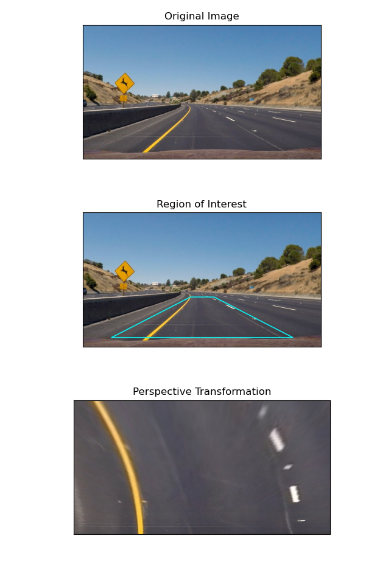

# enhanced-lane-detection

## Description

Enhanced-lane-detection is an extension of [lane-detection](https://github.com/byunsy/lane-detection) which was part of my study on computer vision for autonomous vehicles. This project goes further than simply detecting lines on a clear road and is capable of accurately detecting and highlighting lanes for different light conditions (shadows, unclear markings, etc). Additionally, it calculates and displays curvature and offset information for the vehicle at every frame.

Overall, the program has six main parts:

1. **Camera Calibration:** Using the chessboard calibration method (provided by OpenCV), the program calculates the object points (3D) and image points (2D) to undistort images that may have been distorted by the camera lens.

2. **Perspective Transformation:** The program calculates the transformation matrix and warps the region of interest within a given image. This process will provide a bird's eye view of the lane to get a better vision of the lane.

3. **Gradient Thresholds:** Using different filters including Sobel threshold (in x), magnitude threshold, direction threshold, HLS threshold, and LUV thresholds, the program effectively finds pixels of interest that will provide useful information for detecting lanes.

4. **Best-fit Calculation**: With the given binary images of pixels of interest, the program finds best-fit curves that represents the lane curvatures.

5. **Curvature and Offset Calculation**: The program calculates the curvature of the best-fit line computed above as well as how much the center of the car is displaced from the center of the detected lane.

6. **Display Combined Elements**: Finally, the program takes in a video and uses a combination of all the steps above to detect, calculate, and highlight the lane for each frame within the video.

## Installation

I used the OpenCV package for python (version 4.1.0.25 or above) with Python 3.7.2

```bash
pip install opencv-python==4.1.0.25
```

## Usage

Clone the enhanced-lane-detection repository in your directory.

```bash
git clone https://github.com/byunsy/enhanced-lane-detection.git
```

Move to your specific directory. Before executing the program, a user must have a valid video inside the "video" directory of the repository and refer to it within the display_lane.py file.

```bash
python display_lane.py
```

## Demonstrations

Camera calibration using chessboard calibration method:


Define region of interest and perform perspective transformation for the ROI:


Apply multiple gradient thresholds to attain meaningful pixels in white:


First calculation of a best-fit polynomial using sliding windows in the binary image:


Second calculation of a best-fit polynomial using margins around the first best-fit line:


Highlight the detected lane and display the computed curvature / offset information:

